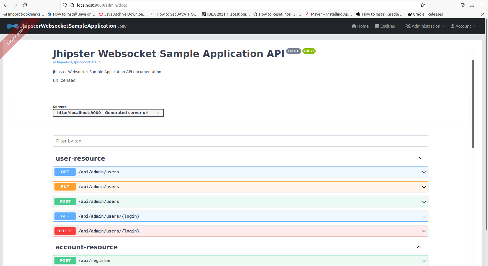

# Using Websockets - JHipster | Sample Application

Это приложение было сгенерировано с использованием **JHipster 7.8.1**, вы можете найти документацию и помощь по адресу [https://www.jhipster.tech](https://www.jhipster.tech).

- `Tutorial`: https://www.jhipster.tech/using-websockets
- `Repo`: https://github.com/jhipster/jhipster-sample-app-websocket

  
  
  

- http://localhost:8080
  
  ```shell
  npm install
  npm start
  ```
- http://localhost:9000
  
  
  
- http://localhost:9000/admin/docs
  
  

---

#### SaaS — что это такое?

- https://blog.ringostat.com/ru/chto-takoe-saas-i-kak-eto-rabotaet

`SaaS` (software as a service) — расшифровывается как программное обеспечение как услуга.
SaaS — это модель предоставления лицензии на программное обеспечение по подписке.
Чаще всего SaaS — это облачное решение находящееся на серверах в интернете.

#### 1. Общий обзор протокола WebSocket

- https://www.section.io/engineering-education/getting-started-with-spring-websockets
  - https://www.devglan.com/spring-boot/spring-boot-websocket-example
  - https://www.codetd.com/en/article/6320261
  - https://docs.spring.io/spring-security/reference/5.6.0-RC1/servlet/integrations/websocket.html
  - [Spring Boot WebSocket STOMP SockJS Example](https://www.javaguides.net/2019/06/spring-boot-websocket-stomp-sockjs-example.html)
    - WebSocket-протокол предоставляет стандартизированный способ установления полнодуплексного двустороннего канала связи между клиентом и сервером по TCP-соединению, но он предназначен для работы через HTTP-протокол и использует порты 80 и 443;
    - Взаимодействие WebSocket-а начинается с HTTP-запроса, который использует HTTP **Upgrade**-заголовок для переключения на протокол WebSocket;
    - A вместо обычного статус-кода-200 от сервера с поддержкой WebSocket-а возвращается статус-кода-101:
      
      
  - [Spring intro to Security and WebSockets](https://www.baeldung.com/spring-security-websockets)
    - [Spring WebSocket security | configuration] https://docs.spring.io/spring-security/site/docs/4.2.x/reference/html/websocket.html
    - [Spring introduction to WebSocket](https://docs.spring.io/spring-framework/docs/current/reference/html/web.html#websocket)
    - [Пример браузерного кода WebSocket](https://learn.javascript.ru/websockets)

При использовании HTTP клиент взаимодействует с сервером посредством серии запросов и ответов.
С каждым запросом клиент открывает новое соединение, пока сервер не отправит ответ.

`SSE` (Server-Sent Events) — это серверная push-технология, позволяющая браузеру получать автоматические обновления с сервера через HTTP-соединение.
В событии отправленным из сервера, сервер создает ответ в формате текста/потока событий, а веб-страница автоматически получает обновления.

`WebSocket` — это протокол связи для постоянно открытых двусторонних соединений между веб-клиентом и сервером.
Сначала клиент отправляет специальный запрос, называемый рукопожатием.
Если ответ успешен, сервер открывает WebSocket-соединение на столько времени на сколько ему нужно.
При открытом соединении клиент и сервер отправляют сообщения на конечные точки URL-адресов (подобно тому, как и HTTP).
Как только соединение WebSocket установлено между клиентом и сервером, обе стороны могут бесконечно обмениваться информацией, пока соединение не будет закрыто кем-либо из сторон.

Однако, в отличие от HTTP, WebSocket-протокол не определяет формат сообщения.
Вместо этого клиент и сервер могут согласовать под-протокол во время рукопожатия и этот под-протокол будет определять способ форматирования всех отправляемых и получаемых сообщений.
Под-протокол, который мы будем использовать в этом руководстве, называется `STOMP`.

`STOMP` (Streaming Text Oriented Messaging Protocol) — это простой протокол обмена текстовыми сообщениями (этот под-протокол, очень похожий на HTTP), каждый раз, когда любая из сторон отправляет данные, они должны отправлять данные в виде фрейма.
`Фрейм` — имеет структуру, аналогичную HTTP-запросу.

- У него (как и у HTTP-методов) есть глагол, связанный с назначением фрейма (например: **CONNECT**, **DISCONNECT**).
- Он также содержит: **заголовок** — для предоставления дополнительной информации другой стороне; и **тело** — для предоставления основного содержимого;

Каждый пользователь будет отправлять сообщения на конечную точку `/app/chat` и подписываться на получение сообщений от `/topic/messages`.
Единственная зависимость, которая нам понадобится — это зависимость `spring-boot-starter-websocket`.
Затем нужно создать класс конфигурации, чтобы зарегистрировать наши конечные STOMP-точки и позволить использовать дополнительный инструмент под названием `SockJS`.
`SockJS` — позволяет создавать планы для резервного копирования на случай, если клиент не может подключиться через WebSocket.
(Это особенно полезно, если мы хотим разрешить использование старых браузеров, не поддерживающих WebSockets)

```java
@Configuration
@EnableWebSocketMessageBroker
public class WebSocketConfiguration implements WebSocketMessageBrokerConfigurer {

  @Override
  public void configureMessageBroker(MessageBrokerRegistry registry) {
    // Set prefix for the endpoint that the client listens for our messages from
    registry.enableSimpleBroker("/topic");

    // Set prefix for endpoints the client will send messages to
    registry.setApplicationDestinationPrefixes("/app");
  }

  @Override
  public void registerStompEndpoints(StompEndpointRegistry registry) {
    // Registers the endpoint where the connection will take place
    registry
      .addEndpoint("/stomp")
      // Allow the origin http://localhost:63343 to send messages to us. (Base URL of the client)
      .setAllowedOrigins("http://localhost:63343")
      // Enable SockJS fallback options
      .withSockJS();
  }
}

```

Как и при создании конечных REST-точек, здесь будем использовать контроллеры для обработки **фреймов**.
Единственное отличие состоит в том, что мы будем по-разному аннотируем наши методы, чтобы сказать, что мы отправляем их на конечные WebSocket-точки.
У нас есть аннотация `@MessageMapping` со значением `/chat` — мы используем ее, чтобы указать, что наш метод получает сообщения от `/app/chat`.
У нас также есть аннотация `@SendTo` со значением `/topic/messages` — мы используем ее, чтобы отправленные сообщения с одной конечной точки перенаправить на другую конечную точку.

```java
@Controller
public class MessageController {

  // Handles messages from /app/chat. (Note the Spring adds the /app prefix for us).
  @MessageMapping("/chat")
  // Sends the return value of this method to /topic/messages
  @SendTo("/topic/messages")
  public MessageDto getMessages(MessageDto dto) {
    return dto;
  }
}

```

Теперь нужно подключиться к этим конечным точкам на стороне клиента, которая будет простой HTML-страницей.

1. Во-первых, создаем экземпляр SockJS-клиента с URL-адресом, по которому будет происходить рукопожатие;
2. Затем создаем экземпляр Stomp-клиента (используя наш SockJS-клиент), который будем использовать для подключения к серверу;
   - С этим экземпляром клиента stomp мы вызываем метод-connect с пустым объектом и функцией обратного вызова.
   - Пустой объект представляет заголовки, которые будем отправлять с нашим фреймом.
   - Функцию обратного вызова подписываемся на получение сообщений от нашей конечной точки `/topic/messages`.
   - Далее есть наша функция `sendMessage` — она просто берет значение нашего элемента ввода и отправляет его в конечную точку `/app/chat` с пустыми заголовками.

```javascript
// Try to set up WebSocket connection with the handshake at "http://localhost:8080/stomp"
let sock = new SockJS('http://localhost:8080/stomp');

// Create a new StompClient object with the WebSocket endpoint
let client = Stomp.over(sock);

// Start the STOMP communications, provide a callback for when the CONNECT frame arrives.
client.connect({}, frame => {
  // Subscribe to "/topic/messages". Whenever a message arrives add the text in a list-item element in the unordered list.
  client.subscribe('/topic/messages', payload => {
    let message_list = document.getElementById('message-list');
    let message = document.createElement('li');
    message.appendChild(document.createTextNode(JSON.parse(payload.body).message));
    message_list.appendChild(message);
  });
});

// Take the value in the ‘message-input’ text field and send it to the server with empty headers.
function sendMessage() {
  let input = document.getElementById('message-input');
  let message = input.value;
  client.send('/app/chat', {}, JSON.stringify({ message: message }));
}
```

#### 2. Реализация безопасности WebSocket

- https://www.section.io/engineering-education/getting-started-with-spring-websockets

Зависимость, которую нам понадобится — это зависимость `spring-boot-starter-security`.

Далее нам нужно настроить безопасность в Spring для нашего приложения:

```java
@Configuration
@EnableWebSecurity
public class AppSecurityConfig extends WebSecurityConfigurerAdapter {

  @Autowired
  private AppUserDetailsService userDetailsService;

  @Override
  protected void configure(HttpSecurity http) {
    // Set up simplified security settings requiring Spring to authenticate every request
    http.csrf().disable().authorizeRequests().anyRequest().fullyAuthenticated();
  }

  @Override
  public void configure(WebSecurity web) {
    // Tell Spring to ignore securing the handshake endpoint. This allows the handshake to take place unauthenticated
    web.ignoring().antMatchers("/stomp/**");
  }

  @Override
  protected void configure(AuthenticationManagerBuilder auth) {
    auth.userDetailsService(userDetailsService).passwordEncoder(passwordEncoder());
  }

  // Create an AuthenticationManager bean to Authenticate users in the ChannelInterceptor
  @Bean
  public AuthenticationManager authManager() {
    return this.authenticationManager();
  }

  @Bean
  public PasswordEncoder passwordEncoder() {
    return new BCryptPasswordEncoder(10);
  }
}

```

Потом нужно создать простой сервис **WebSocketAuthenticatorService**, чтобы взять и проверить заданное имя пользователя и пароль...
Теперь, когда мы создали этот сервис **WebSocketAuthenticatorService**, нам нужно на стороне сервера создать и зарегистрировать наш **ChannelInterceptor** для использования в Spring:

```java
@Service
public class AuthChannelInterceptor implements ChannelInterceptor {

  private final WebSocketAuthenticatorService service;
  private static final String USERNAME_HEADER = "username";
  private static final String PASSWORD_HEADER = "password";

  @Autowired
  public AuthChannelInterceptor(WebSocketAuthenticatorService service) {
    this.service = service;
  }

  // Processes a message before sending it
  @Override
  public Message<?> preSend(Message<?> message, MessageChannel channel) {
    // Instantiate an object for retrieving the STOMP headers
    final StompHeaderAccessor accessor = MessageHeaderAccessor.getAccessor(message, StompHeaderAccessor.class);
    // Check that the object is not null
    assert accessor != null;
    // If the frame is a CONNECT frame
    if (accessor.getCommand() == StompCommand.CONNECT) {
      // retrieve the username from the headers
      final String username = accessor.getFirstNativeHeader(USERNAME_HEADER);
      // retrieve the password from the headers
      final String password = accessor.getFirstNativeHeader(PASSWORD_HEADER);
      // authenticate the user and if that's successful add their user information to the headers.
      UsernamePasswordAuthenticationToken user = service.getAuthenticatedOrFail(username, password);
      accessor.setUser(user);
    }
    return message;
  }
}

```

И добавим следующий метод **configureClientInboundChannel** в наш класс **WebSocketConfiguration**:

```java
@Configuration
@EnableWebSocketMessageBroker
public class WebSocketConfiguration implements WebSocketMessageBrokerConfigurer {

  @Override
  public void configureMessageBroker(MessageBrokerRegistry registry) {
    // Set prefix for the endpoint that the client listens for our messages from
    registry.enableSimpleBroker("/topic");

    // Set prefix for endpoints the client will send messages to
    registry.setApplicationDestinationPrefixes("/app");
  }

  @Override
  public void registerStompEndpoints(StompEndpointRegistry registry) {
    // Registers the endpoint where the connection will take place
    registry
      .addEndpoint("/stomp")
      // Allow the origin http://localhost:63343 to send messages to us. (Base URL of the client)
      .setAllowedOrigins("http://localhost:63343")
      // Enable SockJS fallback options
      .withSockJS();
  }

  @Override
  public void configureClientInboundChannel(ChannelRegistration registration) {
    // Add our interceptor for authentication/authorization
    registration.interceptors(channelInterceptor);
  }
}

```

И наконец, нам нужно учесть все эти изменения в клиентском приложении.

```javascript
/*
 Same as the above example, only adding username and password headers. The rest should stay the same. 
 See "Implementing WebSockets in Spring" above for details of how the client works.
*/
client.connect({ username: 'Jimbob', password: 'pass' }, frame => {
  client.subscribe('/topic/messages', payload => {
    let message_list = document.getElementById('message-list');
    let message = document.createElement('li');

    message.appendChild(document.createTextNode(JSON.parse(payload.body).message));

    message_list.appendChild(message);
  });
});
```

#### You can create a WebSocket request from the left sidebar in Postman

- https://learning.postman.com/docs/sending-requests/supported-api-frameworks/websocket

---

## Project Structure

Node is required for generation and recommended for development. `package.json` is always generated for a better development experience with prettier, commit hooks, scripts and so on.

In the project root, JHipster generates configuration files for tools like git, prettier, eslint, husk, and others that are well known and you can find references in the web.

`/src/*` structure follows default Java structure.

- `.yo-rc.json` - Yeoman configuration file
  JHipster configuration is stored in this file at `generator-jhipster` key. You may find `generator-jhipster-*` for specific blueprints configuration.
- `.yo-resolve` (optional) - Yeoman conflict resolver
  Allows to use a specific action when conflicts are found skipping prompts for files that matches a pattern. Each line should match `[pattern] [action]` with pattern been a [Minimatch](https://github.com/isaacs/minimatch#minimatch) pattern and action been one of skip (default if ommited) or force. Lines starting with `#` are considered comments and are ignored.
- `.jhipster/*.json` - JHipster entity configuration files

- `npmw` - wrapper to use locally installed npm.
  JHipster installs Node and npm locally using the build tool by default. This wrapper makes sure npm is installed locally and uses it avoiding some differences different versions can cause. By using `./npmw` instead of the traditional `npm` you can configure a Node-less environment to develop or test your application.
- `/src/main/docker` - Docker configurations for the application and services that the application depends on

## Development

Before you can build this project, you must install and configure the following dependencies on your machine:

1. [Node.js][]: We use Node to run a development web server and build the project.
   Depending on your system, you can install Node either from source or as a pre-packaged bundle.

After installing Node, you should be able to run the following command to install development tools.
You will only need to run this command when dependencies change in [package.json](package.json).

```
npm install
```

We use npm scripts and [Angular CLI][] with [Webpack][] as our build system.

Run the following commands in two separate terminals to create a blissful development experience where your browser
auto-refreshes when files change on your hard drive.

```
./mvnw
npm start
```

Npm is also used to manage CSS and JavaScript dependencies used in this application. You can upgrade dependencies by
specifying a newer version in [package.json](package.json). You can also run `npm update` and `npm install` to manage dependencies.
Add the `help` flag on any command to see how you can use it. For example, `npm help update`.

The `npm run` command will list all of the scripts available to run for this project.

### PWA Support

JHipster ships with PWA (Progressive Web App) support, and it's turned off by default. One of the main components of a PWA is a service worker.

The service worker initialization code is disabled by default. To enable it, uncomment the following code in `src/main/webapp/app/app.module.ts`:

```typescript
ServiceWorkerModule.register('ngsw-worker.js', { enabled: false }),
```

### Managing dependencies

For example, to add [Leaflet][] library as a runtime dependency of your application, you would run following command:

```
npm install --save --save-exact leaflet
```

To benefit from TypeScript type definitions from [DefinitelyTyped][] repository in development, you would run following command:

```
npm install --save-dev --save-exact @types/leaflet
```

Then you would import the JS and CSS files specified in library's installation instructions so that [Webpack][] knows about them:
Edit [src/main/webapp/app/app.module.ts](src/main/webapp/app/app.module.ts) file:

```
import 'leaflet/dist/leaflet.js';
```

Edit [src/main/webapp/content/scss/vendor.scss](src/main/webapp/content/scss/vendor.scss) file:

```
@import '~leaflet/dist/leaflet.css';
```

Note: There are still a few other things remaining to do for Leaflet that we won't detail here.

For further instructions on how to develop with JHipster, have a look at [Using JHipster in development][].

### Using Angular CLI

You can also use [Angular CLI][] to generate some custom client code.

For example, the following command:

```
ng generate component my-component
```

will generate few files:

```
create src/main/webapp/app/my-component/my-component.component.html
create src/main/webapp/app/my-component/my-component.component.ts
update src/main/webapp/app/app.module.ts
```

### JHipster Control Center

JHipster Control Center can help you manage and control your application(s). You can start a local control center server (accessible on http://localhost:7419) with:

```
docker-compose -f src/main/docker/jhipster-control-center.yml up
```

## Building for production

### Packaging as jar

To build the final jar and optimize the jhipsterWebsocketSampleApplication application for production, run:

```
./mvnw -Pprod clean verify
```

This will concatenate and minify the client CSS and JavaScript files. It will also modify `index.html` so it references these new files.
To ensure everything worked, run:

```
java -jar target/*.jar
```

Then navigate to [http://localhost:8080](http://localhost:8080) in your browser.

Refer to [Using JHipster in production][] for more details.

### Packaging as war

To package your application as a war in order to deploy it to an application server, run:

```
./mvnw -Pprod,war clean verify
```

## Testing

To launch your application's tests, run:

```
./mvnw verify
```

### Client tests

Unit tests are run by [Jest][]. They're located in [src/test/javascript/](src/test/javascript/) and can be run with:

```
npm test
```

UI end-to-end tests are powered by [Protractor][], which is built on top of WebDriverJS. They're located in [src/test/javascript/e2e](src/test/javascript/e2e)
and can be run by starting Spring Boot in one terminal (`./mvnw spring-boot:run`) and running the tests (`npm run e2e`) in a second one.

### Other tests

Performance tests are run by [Gatling][] and written in Scala. They're located in [src/test/gatling](src/test/gatling).

To use those tests, you must install Gatling from [https://gatling.io/](https://gatling.io/).

For more information, refer to the [Running tests page][].

### Code quality

Sonar is used to analyse code quality. You can start a local Sonar server (accessible on http://localhost:9001) with:

```
docker-compose -f src/main/docker/sonar.yml up -d
```

Note: we have turned off authentication in [src/main/docker/sonar.yml](src/main/docker/sonar.yml) for out of the box experience while trying out SonarQube, for real use cases turn it back on.

You can run a Sonar analysis with using the [sonar-scanner](https://docs.sonarqube.org/display/SCAN/Analyzing+with+SonarQube+Scanner) or by using the maven plugin.

Then, run a Sonar analysis:

```
./mvnw -Pprod clean verify sonar:sonar
```

If you need to re-run the Sonar phase, please be sure to specify at least the `initialize` phase since Sonar properties are loaded from the sonar-project.properties file.

```
./mvnw initialize sonar:sonar
```

For more information, refer to the [Code quality page][].

## Using Docker to simplify development (optional)

You can use Docker to improve your JHipster development experience. A number of docker-compose configuration are available in the [src/main/docker](src/main/docker) folder to launch required third party services.

For example, to start a mysql database in a docker container, run:

```
docker-compose -f src/main/docker/mysql.yml up -d
```

To stop it and remove the container, run:

```
docker-compose -f src/main/docker/mysql.yml down
```

You can also fully dockerize your application and all the services that it depends on.
To achieve this, first build a docker image of your app by running:

```
./mvnw -Pprod verify jib:dockerBuild
```

Then run:

```
docker-compose -f src/main/docker/app.yml up -d
```

For more information refer to [Using Docker and Docker-Compose][], this page also contains information on the docker-compose sub-generator (`jhipster docker-compose`), which is able to generate docker configurations for one or several JHipster applications.

## Continuous Integration (optional)

To configure CI for your project, run the ci-cd sub-generator (`jhipster ci-cd`), this will let you generate configuration files for a number of Continuous Integration systems. Consult the [Setting up Continuous Integration][] page for more information.

[jhipster homepage and latest documentation]: https://www.jhipster.tech
[jhipster 7.8.1 archive]: https://www.jhipster.tech
[using jhipster in development]: https://www.jhipster.tech/development/
[using docker and docker-compose]: https://www.jhipster.tech/docker-compose
[using jhipster in production]: https://www.jhipster.tech/production/
[running tests page]: https://www.jhipster.tech/running-tests/
[code quality page]: https://www.jhipster.tech/code-quality/
[setting up continuous integration]: https://www.jhipster.tech/setting-up-ci/
[node.js]: https://nodejs.org/
[npm]: https://www.npmjs.com/
[webpack]: https://webpack.github.io/
[browsersync]: https://www.browsersync.io/
[jest]: https://facebook.github.io/jest/
[protractor]: https://angular.github.io/protractor/
[leaflet]: https://leafletjs.com/
[definitelytyped]: https://definitelytyped.org/
[angular cli]: https://cli.angular.io/
[gatling]: https://gatling.io/

---

- [Пишем чат с использованием Spring Boot и WebSockets](https://habr.com/ru/company/otus/blog/516702)
- [Using Spring Security with Websocket](https://petervarga301555197.wordpress.com/2019/04/12/using-spring-security-with-websocket)
- [Spring Boot and Spring Security integration WebSocket examples](https://www.codetd.com/en/article/6320261)
